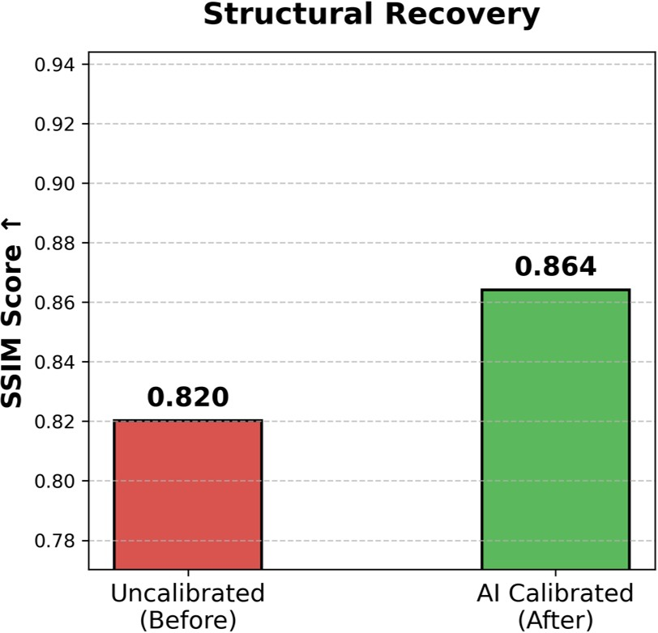

# Learning-Based Sensor Calibration for Photoacoustic Tomography

## Overview

Photoacoustic Tomography (PAT) is an imaging modality that reconstructs the internal structure of an object from acoustic measurements collected by an array of sensors.

In practice, however, sensor locations may deviate from their nominal positions due to manufacturing tolerances, assembly errors, or other physical imperfections. Even small positional errors can lead to inconsistencies between the assumed forward model and the acquired measurements, ultimately degrading image reconstruction quality.

This project investigates a learning-based approach to **sensor calibration for PAT**. Instead of assuming that sensor positions are perfectly known, a neural network is trained to learn the unknown sensor-position perturbation function $\epsilon(s)$ directly from measurement consistency.

The learned calibration is then incorporated into a physics-based forward and inverse reconstruction pipeline, allowing the system to recover images more accurately from miscalibrated measurements.

The project was conducted as part of a research collaboration at Rice University.

## Problem

The forward model assumes that each acoustic sensor is located at a known nominal position $s$. In a real acquisition system, the actual sensor position may instead be shifted by an unknown perturbation:

$$
s_{\text{true}} = s + \epsilon(s)
$$

where $\epsilon(s)$ represents the sensor-position error.

The measurement operator therefore depends on the true sensor geometry:

$$
D = R_{\epsilon}u
$$

while conventional reconstruction may incorrectly assume

$$
D \approx R_{0}u.
$$

This mismatch between the assumed and actual sensor geometry can introduce reconstruction artifacts and reduce image fidelity.

### Goal

The goal of this project is to learn the unknown perturbation function $\epsilon(s)$ from measurement data and use the learned calibration to improve the subsequent image reconstruction.

## Approach

The project follows a physics-informed learning pipeline:

1. **Model the physical forward operator**
   - Define the UST/PAT measurement operator based on the assumed sensor geometry.
   - The physical propagation model is kept fixed.

2. **Introduce sensor-position perturbation**
   - Generate measurements using a known but hidden perturbation function $\epsilon(s)$.
   - The reconstruction model initially assumes $\epsilon(s)=0$.

3. **Generate diverse training objects**
   - Construct synthetic images containing discrete points, high-frequency patterns, small circular structures, sharp edges, and noise.
   - These objects provide diverse spatial features for learning sensor calibration.

4. **Learn the perturbation function**
   - Represent $\epsilon(s)$ using a neural network.
   - Train the network by minimizing the discrepancy between predicted and ground-truth measurements.

5. **Apply the learned calibration**
   - Use the learned sensor shift to modify the forward model during reconstruction.

6. **Evaluate reconstruction quality**
   - Compare uncalibrated and calibrated reconstructions using PSNR and SSIM.

### Technologies

- Python
- JAX
- Neural Networks
- Tomography
- Photoacoustic Tomography (PAT)
- Image Reconstruction

## Implementation

The project was implemented in Python using JAX and Equinox, with Optax for optimization and Matplotlib for visualization.

### Neural Network

A multilayer perceptron (MLP) is used to represent the unknown sensor perturbation function:

$$
\epsilon(s) = f_{\theta}(s)
$$

The network takes the normalized sensor position as input and predicts the corresponding positional correction.

The output is constrained using a hyperbolic tangent activation to keep the predicted perturbation within a physically reasonable range.

### Physics-Based Forward Model

The forward operator computes the measurement contribution of each image pixel based on the sensor geometry and a Gaussian kernel:

$$
K_{\lambda}(L_y) = \exp\left(-\frac{\lambda}{2}L_y^2\right)
$$

The physical parameter $\lambda$ is fixed during training, while the sensor-position perturbation is learned.

### Training

The model is optimized using the AdamW optimizer with a cosine-decay learning-rate schedule.

The training data consists of newly generated synthetic images containing a combination of:

- Discrete point sources
- High-frequency checkerboard patterns
- Multiple small disks
- Sharp cross-shaped structures
- Random noise

A Huber loss is used to measure the discrepancy between the predicted and ground-truth measurement data.

### Reconstruction

After training, the learned perturbation function is incorporated into a Neumann-series-based inverse reconstruction procedure.

Two reconstruction settings are compared:

- **Uncalibrated:** assumes $\epsilon(s)=0$
- **AI Calibrated:** uses the learned $\epsilon(s)$

## Results

The learned calibration function successfully captures the underlying sensor-position perturbation and improves the consistency between the assumed forward model and the measurement data.

### Learned Sensor Calibration

The learned perturbation function $\epsilon_{\theta}(s)$ is compared against the ground-truth perturbation:

- Ground Truth: $\epsilon(s)$
- Learned: $\epsilon_{\theta}(s)$

The model learns the overall spatial trend of the sensor displacement despite never being directly provided with the ground-truth perturbation during optimization.

### Reconstruction Performance

The learned calibration is then incorporated into the inverse reconstruction pipeline.

The reconstruction quality is evaluated using the **SSIM (Structural Similarity Index)**

The results compare:

| Method | Sensor Calibration | Reconstruction |
|---|---|---|
| Uncalibrated | $\epsilon(s)=0$ | Baseline |
| AI Calibrated | Learned $\epsilon_{\theta}(s)$ | Improved reconstruction |

<p align="center">
  
</p>

## Repository Structure
```text
.
├── DayXX_*.py
│   └── Mathematical and experimental exercises developed during the research process
│
├── training_first_try.py
│   └── Initial neural-network regression experiment
│
├── visualize_prediction_performance.py
│   └── 2D function approximation and neural-network visualization
│
├── visualize_image_USTdata.py
│   └── Initial UST forward-model and measurement-space visualization
│
├── visualize_loss_and_perturbance_function.py
│   └── First learning experiment for the sensor perturbation function
│
├── final_realistic_problems.py
│   └── Final end-to-end sensor calibration and reconstruction pipeline
│
├── figures/
│   └── Training, calibration, and reconstruction visualizations
│
└── README.md

## My Contribution

I was responsible for developing and integrating the learning-based sensor calibration pipeline, with a focus on connecting the mathematical model, physical forward operator, neural network, and image reconstruction components.

My work included:

- Developing the physics-based UST(ultrasound transform) forward model in JAX.
- Formulating sensor-position perturbation as a learnable function $\epsilon(s)$.
- Designing and integrating the MLP-based calibration model into the forward operator.
- Implementing differentiable training using JAX automatic differentiation and Equinox.
- Developing synthetic training data with diverse spatial structures and noise.
- Implementing the inverse reconstruction procedure using a Neumann-series-based approach.
- Designing quantitative evaluation using SSIM.
- Building visualization tools to analyze training behavior, learned calibration functions, and reconstruction quality.
- Integrating the complete pipeline from synthetic data generation to calibrated image reconstruction.

Overall, my primary contribution was bridging the gap between the mathematical/physical formulation and the machine-learning implementation, turning the calibration problem into an end-to-end differentiable learning and reconstruction pipeline.

## Poster

[View the full research poster](./poster.pdf)

## Acknowledgments

This project was conducted during my research experience in the Department of Electrical and Computer Engineering at Rice University, under the guidance of my research mentor, Mitchell Roddenberry, and my advisor, Professor Richard Baraniuk.
